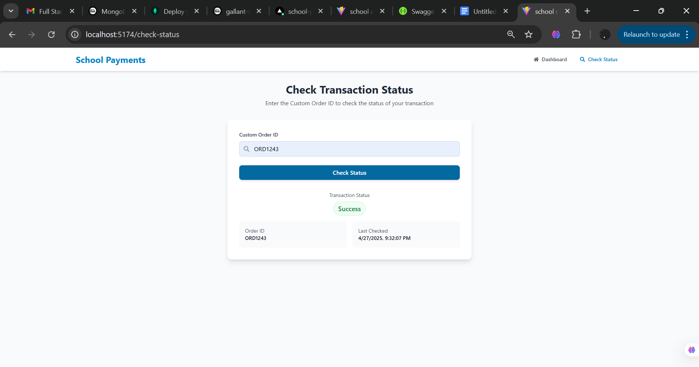

# School Payments Dashboard Frontend

## Tech Stack
- React.js
- Axios
- Tailwind CSS / Bootstrap / Material UI
- React Router

## Features
- Transactions dashboard with filters and pagination
- School-based transaction filter
- Transaction status checker

## Deployment
- Hosted URL: [https://school-payments-frontend.vercel.app/]

## Setup Instructions
1. Clone the repo
2. Install dependencies: `npm install`
3. Start the dev server: `npm run dev` (for Vite) or `npm start` (for CRA)

## Screenshots

